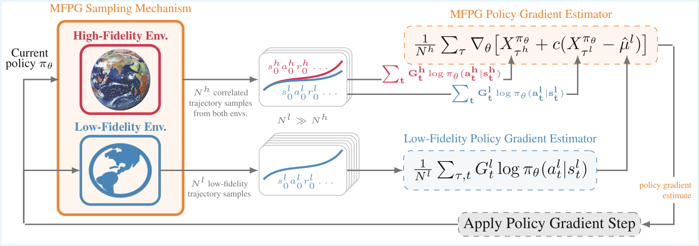

# **M**ulti**F**idelity**P**olicy**G**radients

This repository contains the official code for the work:
“A **M**ulti-**F**idelity Control Variate Approach for **P**olicy **G**radient Estimation.”

MFPG is a reinforcement learning framework that mixes a small amount of data from the target environment with a control variate formed from a large volume of low-fidelity simulation data to construct an unbiased, variance-reduced estimator for on-policy policy gradients and improve sample efficiency. 

<p align="center">
  
</p>


## Installation

1. Create a conda environment: `conda create -n mfpg`

2. Activate the environment `conda activate mfpg`

3. Install dependencies: `pip install -r requirements.txt`

4. Install MuJoCo: 

* `pip3 install -U 'mujoco-py<2.2,>=2.1'`

* Follow the official [MuJoCo installation guide](https://github.com/openai/mujoco-py#install-mujoco) (The "Install MuJoCo" section)

* `pip install "cython<3"`

* Add the following to your `~/.bashrc` file: 

```
export LD_LIBRARY_PATH=$LD_LIBRARY_PATH:$YOUR_HOME_DIRECTORY/.mujoco/mujoco210/bin

export LD_LIBRARY_PATH=$LD_LIBRARY_PATH:/usr/lib/nvidia
```

## Running Experiments

Configuration files are located in `config/odrl_mujoco_sweep`, covering:

* **MFPG**, High-Fidelity Only, More High-Fidelity Data (15×) (`config/odrl_mujoco_sweep/baseline_reinforce_mfpg/`)

* [DARC](https://arxiv.org/pdf/2006.13916)

* [PAR](https://arxiv.org/pdf/2405.15369)

* Low-Fidelity Only

**Example**: training MFPG on gravity and friction shift tasks:

```
python src/train/train_on_odrl_benchmark.py --algorithm "baseline_reinforce_mfpg" --config_file_name "mfpg_gravity_friction"
```

To reproduce Appendix C results, replace `--algorithm` with the name of a folder under `config/odrl_mujoco_sweep` and select the corresponding config file with `--config_file_name`.


## Acknowledgements

We implement our project on top of [Stable-Baselines3](https://github.com/DLR-RM/stable-baselines3) and conduct our evaluation using settings from [ODRLBenchmark](https://github.com/OffDynamicsRL/off-dynamics-rl) (files located in `odrl_benchmark/` are copied from ODRLBenchmark). 
